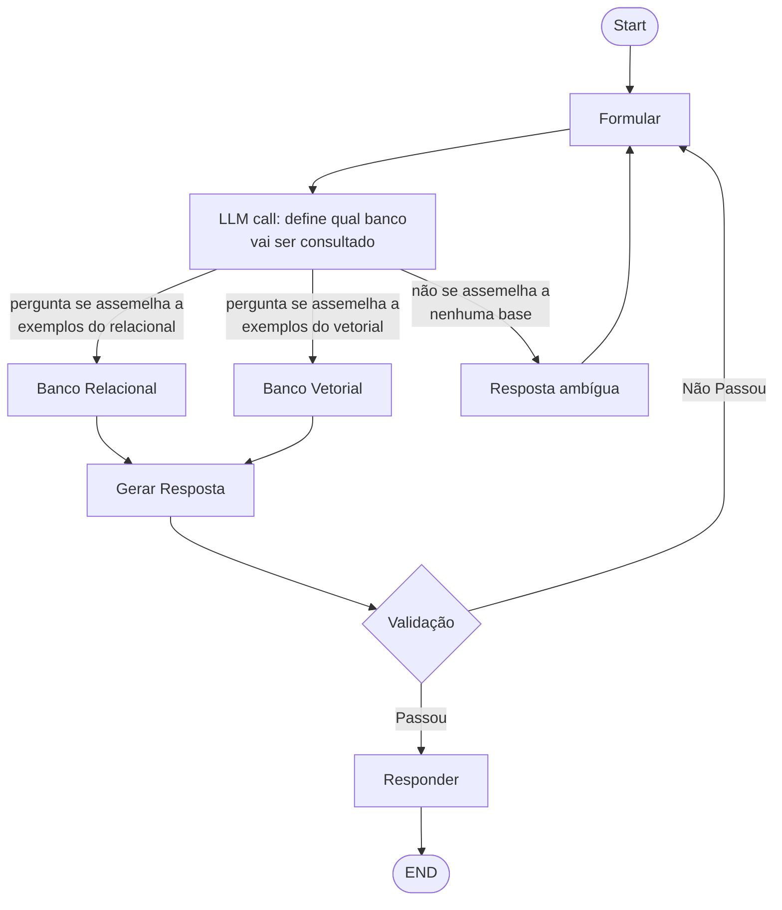

## Grafo de estados

```mermaid
flowchart TD
    Start([Start]) --> Formular
    Formular --> Decisao[LLM call: define qual banco<br/>vai ser consultado]

    Decisao -->|pergunta se assemelha a<br/>exemplos do relacional| Relacional[Banco Relacional]
    Decisao -->|pergunta se assemelha a<br/>exemplos do vetorial| Vetorial[Banco Vetorial]
    Decisao -->|não se assemelha a<br/>nenhuma base| Ambigua[Resposta ambígua]

    Relacional --> Gerar[Gerar Resposta]
    Vetorial --> Gerar
    Ambigua --> Formular

    Gerar --> Validacao{Validação}
    Validacao -->|Passou| Responder
    Validacao -->|Não Passou| Formular

    Responder --> Fim([END])
```